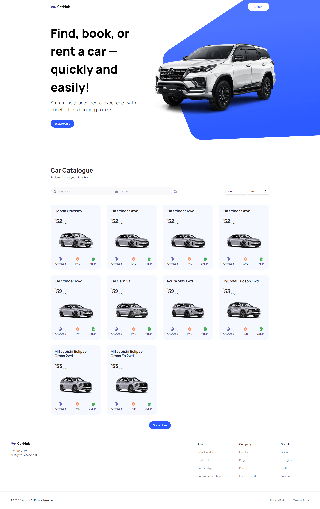

<h1 align="center"> Car Hub </h1>

Projeto desenvolvido com Next.js 13, com base nos ensinamentos do vídeo - [Build and Deploy a Modern Next.js 13 Application | React, Next JS 13, TypeScript, Tailwind CSS](https://youtu.be/pUNSHPyVryU) do canal [@javascriptmastery](https://www.youtube.com/@javascriptmastery) no Youtube. 

<p align="center">
  <a href="#-tecnologias">🚀 Tecnologias</a>&nbsp;&nbsp;&nbsp;|&nbsp;&nbsp;&nbsp;
  <a href="#-projeto">💻 Projeto</a>&nbsp;&nbsp;&nbsp;|&nbsp;&nbsp;&nbsp;
  <a href="#-instruções"> 📋 Instruções</a>&nbsp;&nbsp;&nbsp;|&nbsp;&nbsp;&nbsp;
  <a href="#-layout">🔖 Layout</a>&nbsp;&nbsp;&nbsp;|&nbsp;&nbsp;&nbsp;
  <a href="#-licença">📝 Licença</a>
</p>

<br>

<p align="center">
  
</p>

## 🚀 Tecnologias

Esse projeto foi desenvolvido com as seguintes tecnologias:

- [Next.JS](https://nextjs.org/)
- [NodeJS](https://nodejs.org/)
- [React](https://react.dev/)
- [Tailwind CSS](https://tailwindcss.com/)
- [TypeScript](https://www.typescriptlang.org/)


<br>

## 💻 Projeto

Car Hub é um site que tem como objetivo pesquisar, reservar e alugar carros, nele é possível filtrar os automóveis por marca, modelo, tipo de combustível e ano. O site conta com cards com imagens e diversas informações sobre os veículos disponiveis no catálago. Neste projeto foi utilizado o [Next.JS](https://nextjs.org/), framework para React, que contribui para a produção de código priorizando a eficiência de tempo. A linguagem utilizada foi o [TypeScript](https://www.typescriptlang.org/) e a estilização do projeto foi feita através do [Tailwind CSS](https://tailwindcss.com/). Neste projeto foram consumidas duas APIs, uma para obter os dados dos veículos, [Cars by API-Ninjas](https://rapidapi.com/apininjas/api/cars-by-api-ninjas), e outra para as imagens dos veículos, [Imagin Studio](https://www.imagin.studio/).


## 📋 Instruções

### Clone o projeto e acesse a pasta.

```bash
$ git clone https://github.com/ThiagoMonts/car_showcase.git
```
```bash
$ cd car_showcase
```

<br>

### Siga o passo a passo:

Instale as dependências
```bash
$ cd car_showcase
```
```bash
$ npm install
```

<br>

Inicie o projeto
```bash
$ npm start
```

<br>

Crie um arquivo .env e crie suas credenciais.

<br>

## 🔖 Layout

Você pode acessar o site através [DESSE LINK](https://thiagomonts-car-showcase.vercel.app/).

<br>

## 📝 Licença

Esse projeto está sob a licença MIT.

---

Desenvolvido por [Thiago Honorato](https://www.linkedin.com/in/honoratothiago/)
